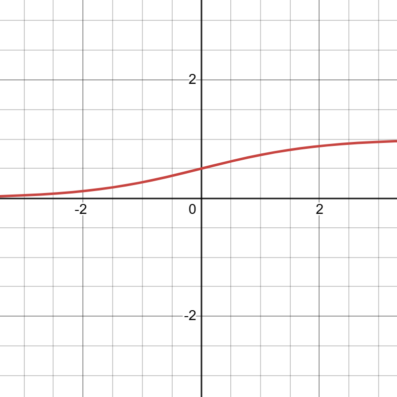

# Logistic Regression
## Mathematical Definition

### 1- Ordinary Linear Regression

$$z_i=\theta^TX_i$$

- standard linear regression
- produces any real value
  

### 2- Sigmoid function

$$\boxed{\sigma(z) = \frac{1}{1 + e^{-z}}}$$
- convert the linear output into a probability between 0  and 1

### 3- Estimated probability

$$h_\theta(X_i)_i=\sigma(z_i)$$

  

### 4- Likelyhood:

$$L(\theta)=\prod_{i=1}^{n} [h_\theta(X_i)]^{y_i}[1-h_\theta(X_i)]^{1-y_i}$$
- measures how well the parameters fit the training data
- The more correct we are → this function gets closer to 1
- The more wrong we are → this function gets closer to 0
- We want to find parameters θ that maximize this likelihood.

#### 3 problems:

1) **Numerically unstable** function(multiplication of multiple numbers &lt; 1 ) &rarr; ln

2) We want **minimize not maximize** &rarr; negate(&times;-1)

3) ln turns $\prod$ into $\sum$ &rarr; normalize (&times;$\frac{1}{m}$)

  

### 5- log likelyhood
$$\ell(\theta)=\sum_{i=1}^{m}y_iln(h_\theta(X_i))+(1-y_i)ln(1-h_\theta(X_i))$$
- When y=1: only the first term matters
- When y=0: only the second term matters
### 6- Cross entropy loss
$$\boxed{j(\theta)=-\frac{1}{m}\sum_{i=1}^{m}y_iln(h_\theta(X_i))+(1-y_i)ln(1-h_\theta(X_i))}$$

### 7- Gradient decent
Use the chain rule to compute how the cost changes with respect to each parameter
$$\frac{\partial j}{\partial \theta_k}=
\frac{\partial j}{\partial \ell} \times
\frac{\partial \ell}{\partial h} \times
\frac{\partial h}{\partial z} \times
\frac{\partial z}{\partial \theta_k}
$$

$$\frac{\partial j}{\partial \theta_k}=
[-\frac{1}{m}] \times
[\frac{y}{h}-\frac{1-y}{1-h}] \times
[h(1-h)]\times
X_k
$$
Simplify
$$\frac{\partial j}{\partial \theta_k}=-\frac{1}{m}((y-h)X_k)$$
**Vectorized Gradient**
$$\nabla_\theta J(\theta)=-\frac{1}{m}X^T(h(\theta X)-y)$$
$$\boxed{\nabla_\theta J(\theta)=\frac{1}{m}X^T(y-h(\theta X))}$$

**Parameter update rule:**
$$\boxed{\theta_{new}=\theta_{old}-\lambda J(\theta)}$$
