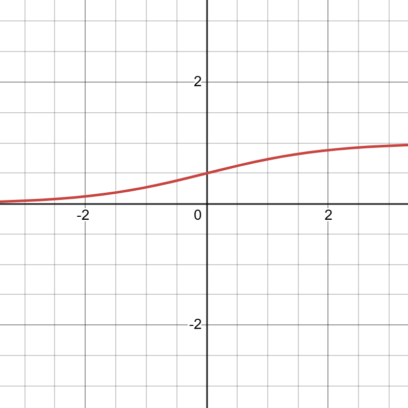

# Logistic Regression
## Mathematical Definition

### 1- Ordinary Linear Regression

$$z_i=\theta^TX_i$$

- standard linear regression
- produces any real value
  

### 2- Sigmoid function

$$\boxed{\sigma(z) = \frac{1}{1 + e^{-z}}}$$
- convert the linear output into a probability between 0  and 1

### 3- Estimated probability

$$h_\theta(X_i)_i=\sigma(z_i)$$

  

### 4- Likelyhood:

$$L(\theta)=\prod_{i=1}^{n} [h_\theta(X_i)]^{y_i}[1-h_\theta(X_i)]^{1-y_i}$$
- measures how well the parameters fit the training data
- The more correct we are → this function gets closer to 1
- The more wrong we are → this function gets closer to 0
- We want to find parameters θ that maximize this likelihood.

#### 3 problems:

1) **Numerically unstable** function(multiplication of multiple numbers &lt; 1 ) &rarr; ln

2) We want **minimize not maximize** &rarr; negate(&times;-1)

3) ln turns $\prod$ into $\sum$ &rarr; normalize (&times;$\frac{1}{m}$)

  

### 5- log likelyhood
$$\ell(\theta)=\sum_{i=1}^{m}y_iln(h_\theta(X_i))+(1-y_i)ln(1-h_\theta(X_i))$$
- When y=1: only the first term matters
- When y=0: only the second term matters
### 6- Cross entropy loss
$$\boxed{j(\theta)=-\frac{1}{m}\sum_{i=1}^{m}y_iln(h_\theta(X_i))+(1-y_i)ln(1-h_\theta(X_i))}$$

### 7- Gradient decent
Use the chain rule to compute how the cost changes with respect to each parameter
$$\frac{\partial j}{\partial \theta_k}=
\frac{\partial j}{\partial \ell} \times
\frac{\partial \ell}{\partial h} \times
\frac{\partial h}{\partial z} \times
\frac{\partial z}{\partial \theta_k}
$$

$$\frac{\partial j}{\partial \theta_k}=
[-\frac{1}{m}] \times
[\frac{y}{h}-\frac{1-y}{1-h}] \times
[h(1-h)]\times
X_k
$$
Simplify
$$\frac{\partial j}{\partial \theta_k}=-\frac{1}{m}((y-h)X_k)$$
**Vectorized Gradient**
$$\nabla_\theta J(\theta)=-\frac{1}{m}X^T(h(\theta X)-y)$$
$$\boxed{\nabla_\theta J(\theta)=\frac{1}{m}X^T(y-h(\theta X))}$$

**Parameter update rule:**
$$\boxed{\theta_{new}=\theta_{old}-\lambda J(\theta)}$$

---

# Softmax Regression
## Mathematical Definition

### 1- Softmax Function

$$\boxed{\text{softmax}(z_i)=\frac{e^{z_i}}{\sum_{j=1}^{K}e^{z_j}}}$$

- Converts a vector of $K$ real-valued scores into a probability distribution
- Each output is in $(0,1)$ and they sum to 1

### 2- Model Hypothesis

For $K$ classes and $n$ features (plus bias):

$$z^{(i)} = \Theta^T X^{(i)}$$

$$\boxed{h_\Theta(X^{(i)}) = \text{softmax}(z^{(i)})}$$

Where $\Theta \in \mathbb{R}^{(n+1)\times K}$ and $h_\Theta(X^{(i)})_k = P(y=k \mid X^{(i)})$ is the predicted probability of class $k$.

### 3- Multi-class Cross-Entropy Loss

$$\boxed{J(\Theta)=-\frac{1}{m}\sum_{i=1}^{m}\sum_{k=1}^{K}y_k^{(i)}\ln(h_\Theta(X^{(i)})_k)}$$

Using indicator notation (only the true class contributes):

$$J(\Theta)=-\frac{1}{m}\sum_{i=1}^{m}\ln(h_\Theta(X^{(i)})_{y^{(i)}})$$

### 4- Gradient Derivation

Using the chain rule for a single parameter $\theta_{k,j}$ (for class $k$, feature $j$):

$$\frac{\partial J}{\partial \theta_{k,j}}=
\frac{\partial J}{\partial h} \times
\frac{\partial h}{\partial z} \times
\frac{\partial z}{\partial \theta_{k,j}}$$

This simplifies to the elegant vectorized form:

$$\nabla_\Theta J(\Theta)=\frac{1}{m}X^T(h_\Theta(X)-Y)$$

Where $Y$ is the one-hot encoded label matrix of shape $(m \times K)$.

**Vectorized Gradient:**

$$\boxed{\nabla_\Theta J(\Theta)=\frac{1}{m}X^T(\text{softmax}(X\Theta)-Y)}$$

### 5- Parameter Update

$$\boxed{\Theta_{new}=\Theta_{old}-\alpha\nabla_\Theta J(\Theta)}$$

### 6- Regularization (L1 / L2)

To prevent overfitting, a penalty term is added to the loss. The bias term is **not** regularized.

**L2 Regularization (Ridge):**

$$J_{reg}(\Theta)=J(\Theta)+\frac{\lambda}{2m}\sum_{j=1}^{n}\theta_j^2$$

$$\nabla_{\Theta} J_{reg}(\Theta)=\nabla_{\Theta} J(\Theta)+\frac{\lambda}{m}\Theta \quad (\text{bias excluded})$$

**L1 Regularization (Lasso):**

$$J_{reg}(\Theta)=J(\Theta)+\frac{\lambda}{m}\sum_{j=1}^{n}|\theta_j|$$

$$\nabla_{\Theta} J_{reg}(\Theta)=\nabla_{\Theta} J(\Theta)+\frac{\lambda}{m}\text{sign}(\Theta) \quad (\text{bias excluded})$$

Where $\lambda > 0$ controls the regularization strength.

---

# Bias-Variance Tradeoff & Diagnosis

## 1- The Tradeoff

- **Bias**: Error from approximating a complex reality with a simple model.
  - High bias $\rightarrow$ model underfits (misses patterns)
- **Variance**: Error from sensitivity to small fluctuations in the training set.
  - High variance $\rightarrow$ model overfits (memorizes noise)

$$\text{Total Error} = \text{Bias}^2 + \text{Variance} + \text{Irreducible Error}$$

## 2- Diagnosing with Learning Curves

Plot **accuracy vs. training set size** for train and validation sets:

- **High Bias**: Both curves converge at low accuracy — adding data won't help.
- **High Variance**: Large gap between train and val accuracy — adding data will help.

## 3- Diagnosing with Regularization Sweeps

Plot **accuracy vs. regularization strength $\lambda$**:

- Low $\lambda$ $\rightarrow$ low train loss, high val loss (overfitting)
- High $\lambda$ $\rightarrow$ high train loss, val loss also high (underfitting)
- Optimal $\lambda$ is where val accuracy peaks

## 4- Diagnosing with Loss Curves

Plot **loss vs. iterations** during training:

- Train loss decreases, val loss decreases $\rightarrow$ **good fit**
- Train loss decreases, val loss starts rising $\rightarrow$ **overfitting** (early stopping helps)
- Both losses stay high $\rightarrow$ **underfitting** (need more capacity or lower $\lambda$)
